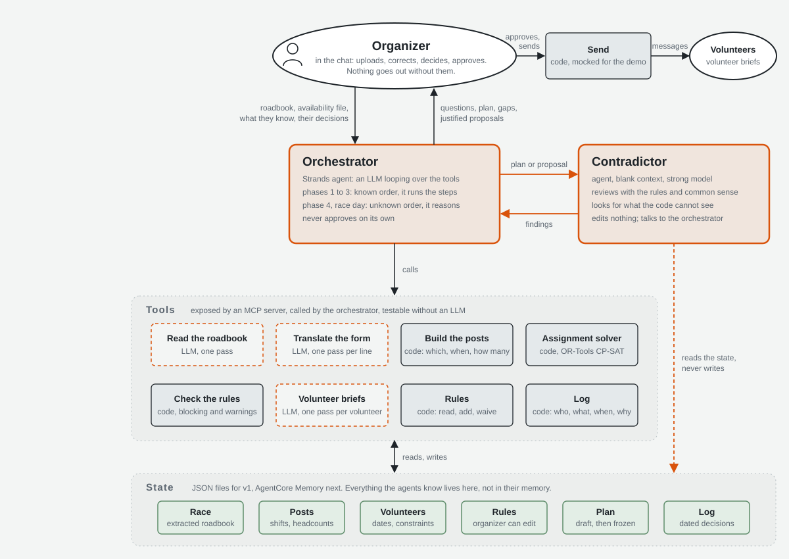

# Rubalise, the volunteer-coordination agent for trail races

*Rubalise* is the striped tape that marks a trail. This agent marks the way for the person who, on every race, spends their evenings with a spreadsheet and three WhatsApp groups: the volunteer coordinator.

Built for the AWS **Agents for Humans** hackathon, track *Good Neighbor Agents*, with [Strands Agents](https://strandsagents.com), a Model Context Protocol server, OR-Tools, and Claude on Amazon Bedrock. Deployed on Amazon Bedrock AgentCore Runtime.

> Demo video: [youtu.be/r-ERVq44WSE](https://youtu.be/r-ERVq44WSE) (4 min 22) · Live demo: a web cockpit (timeline of checkpoints, schedule, chat with the hosted agent), link provided in the submission. The page is in French, like the race it was built on; the "How it works" tab is in English.

## The problem

A 300 to 800 runner trail race needs 50 to 150 volunteers on 30 to 60 shifts: aid stations lost in the mountains, road crossings, sweepers behind the last runner, bib pick-up, finish line, hot meals until midnight. One volunteer, usually unpaid, assigns them all. The inputs are a race roadbook (a PDF made of images) and a sign-up form where people write things like *"samedi toute la journée sauf entre midi et 14h, je peux monter à pied"* or *"je cours le Marathon mais je peux aider le vendredi"*. A hole in a shift means a runner alone on a road at night.

Big events buy volunteer-management platforms where volunteers self-assign to slots. Small races have Google Forms and goodwill. Rubalise is for them.

## What the agent does

Four phases, one conversation, in French:

1. **Inputs.** The organiser drops the roadbook PDF. A vision model extracts checkpoints, first- and last-runner times, cut-offs, services and access notes into a closed JSON schema, and lists what it is unsure about. The organiser corrects in plain language. A *template* ("what a trail race is") turns the sheet into shifts. The sign-up form is translated line by line into the closed vocabulary the solver understands, keeping free-text remarks tagged for later.
2. **The plan.** A constraint solver (OR-Tools CP-SAT) assigns people to shifts under hard rules (availability, skills, minors, overlaps, travel time between sites) and soft weights (minimum staffing, preferences, pairs, workload). A deterministic rule checker relists violations. Then a **second agent with a blank context, the contradictor**, rereads the plan against the volunteers' free-text remarks and says what the code cannot see.
3. **Publication.** Nothing reaches volunteers until the organiser explicitly says so. A hard, code-level gate guards *publish*, *derogate* and *change a rule*. Every decision goes to an append-only journal with its author and reason.
4. **Race day.** "It's 11:00, Marc and Fabien aren't coming." The agent says who and which shifts are hit, re-solves against the published plan with a cost on every change (higher for people already notified, highest for people already on post), and proposes the smallest repair, person by person. Finished shifts never move. It asks before publishing the repair.

The solver never solves a shortage of volunteers. It makes the shortage precise, and actionable: *"Friday 4x4 supply run to the isolated aid stations: 1 missing. 91 people are not free at that time, 6 have no 4x4, 1 has no licence. Closest: Fabien Bender, Simon Rey-Bellet and Charlotte Pittet are free and licensed, they only lack the car: lend one of them a 4x4."* That is what the organiser needs to make a phone call.

## Architecture



The same diagram in French: `docs/architecture_fr.svg`. A PNG for slides: `docs/architecture.png`.

Three posts on the AWS Builder Center tell the build story: [why the model never computes the plan](https://builder.aws.com/content/3JHPzN3TFsbxLsptp50BT3atmem/agents-for-humans-why-my-volunteer-planning-agent-never-computes-the-plan), [the second agent whose only job is to disagree](https://builder.aws.com/content/3JHQtec6ye0V5mkgALG8hn03MU3/agents-for-humans-the-second-agent-whose-only-job-is-to-disagree), and [from a laptop to AgentCore and a live cockpit](https://builder.aws.com/content/3JHRH1HmBbwSgUDwB07Uppohqp6/agents-for-humans-from-a-strands-agent-on-my-laptop-to-agentcore-and-a-live-cockpit). Sources in `docs/blog/`.

Two agents, one tool server, one state:

| Component | Role | Implementation |
|---|---|---|
| Orchestrator | Holds the conversation, calls tools in order for phases 1 to 3, reasons freely on race day | Strands `Agent`, Claude Sonnet 4.6 on Bedrock |
| Contradictor | Rereads every plan with a blank context, read-only tools, returns ranked remarks | Strands `Agent`, Claude Opus 4.6 on Bedrock |
| Tool server | 16 tools: read roadbook, correct the sheet, build shifts, translate the form, solve, verify, plan views, rules, derogations, journal, publish | MCP server (`serveur/serveur_course.py`), stdio locally, HTTP for hosting |
| Solver | Assignment as a boolean grid volunteer × shift, hard constraints and a weighted objective; frozen-plan costs for race day | OR-Tools CP-SAT (`solveur/solveur.py`) |
| Verifier | 9 blocking rules and 11 alerts, deterministic, duplicates by phone number | `outils/verifier.py` |
| State | Course sheet, shifts, volunteers, rules, plan, published plan, journal, sent messages | JSON files per session |
| Hosting | One AgentCore Runtime session per organiser; the MCP server runs inside the session | `agents/agentcore_app.py` |
| Cockpit page | Timeline of checkpoints coloured by staffing, schedule by site, shift detail with team, gaps and nearest candidates, reports from a post, chat with the agent; talks to the hosted agent through a Lambda relay | `web/` |

Design choices that matter:

- **The model never computes the plan.** It fills closed forms (JSON schemas) that code validates. That makes every LLM step testable against ground truth.
- **Rules live in a file the organiser edits from the chat** ("at Blancsex, always two first-aiders"), not in code. A triathlon would be another template file, not another program.
- **Two verifications**: code for the rules it knows, a blank-context agent for what no rule says.
- **Human in the loop by construction**: the gate is in code, not in the prompt. In the terminal it asks; when hosted, it executes only if the organiser's own message contains an explicit confirmation.
- **Stability on race day**: a published plan is a commitment. Changes cost; the solver repairs with the fewest moves.

## Measured results

All on the SwissPeaks Marathon 2025 (46 km, 2 483 m D+, Morgins to Le Bouveret): real roadbook, real course, a synthetic sign-up form of 100 lines (99 volunteers after de-duplication by phone number), 14 deliberate traps.

| What | Result |
|---|---|
| Form translation (free text to closed fields, Claude Opus 4.6), 100 lines | availability 99/100, skills 100/100, night refusal 99/100, companions, leader status, pairs 100/100; the one availability "error" is the runner whose Saturday the model correctly removed |
| Roadbook reading (5 PDF pages as images) | all 6 checkpoints with exact km, altitude, times and cut-offs; bib pick-up and shuttles found; 2 small service icons misread and flagged as doubts |
| Solver, 50 shifts × 99 volunteers | feasible plan in 10 s (not proven optimal); 1 person missing on 1 shift (the Friday 4x4 supply run), with the reason others are excluded and the 3 nearest candidates named |
| Solver, same race with 55 volunteers | optimal in 0.3 s; 19 people missing on 11 shifts, each one named with its reason |
| Race day, 5 no-shows at 06:30 against the published plan | 1 removal, 6 additions, 0.5 s, no shift below its minimum |
| Race day, 15:00, storm: Taney closed, 3 more people needed at Le Grand Pré | 6 removals, 3 additions, one post left without a leader and flagged as such |
| Rule checker | on the raw file it catches the Marathon runner assigned on race day and the two rows with the same phone number; after translation these traps never reach the solver (the runner loses his Saturday, minors are hard rules) |
| Contradictor, unprompted | a post leader whose three unlisted companions carry the whole bib pick-up (if she cancels, the post falls), a helper who is the only named person on the evening standby team, a volunteer on a 13-hour day, a tight 4x4 hand-over between two posts |

Full scenario table: `solveur/sortie/scenarios.md` (run `python solveur/scenarios.py`).

## Run it

```bash
pip install -r requirements.txt          # Python 3.12
aws configure                            # a profile with Bedrock access, region us-east-1
python solveur/solveur.py                # the solver alone, on data/
python outils/verifier.py                # the rule checker on the last plan
python serveur/test_serveur.py           # the MCP server through the real protocol, no LLM
python agents/orchestrateur.py           # the conversation in the terminal
python agents/orchestrateur.py --script agents/demo_script.txt --oui   # the scripted demo
```

LLM tools (translation, roadbook, agents) call Claude on Bedrock: Opus 4.6, Sonnet 4.6 and Haiku 4.5 are the models available on the author's account. Change the model ids at the top of each file.

Hosted version: `agentcore deploy` (AgentCore CLI, CodeZip build, Python 3.12). The entrypoint is `agents/agentcore_app.py`.

Live demo page: `web/` holds a single HTML page and a small Lambda relay behind an HTTP API (`python web/deployer.py --runtime-arn ...`). The relay answers in two steps (start, then poll) because a full plan takes longer than the API's 30-second limit.

### Testing the live demo

The link in the submission opens the cockpit on a fresh session (no login).

1. Click **Calculer le plan** and wait 60 to 90 seconds: the agent loads the race, solves, checks, and the contradictor rereads. The checkpoints on the timeline turn green, orange or red.
2. Click a checkpoint (for instance *Chalet de Blancsex*) to see only its shifts; the Friday supply run is red. Click that bar: the panel says who is missing, why nobody else qualifies, and who is closest.
3. Click a chip under the chat, such as *Jour J : deux absentes*, or type a race-day event in French: the agent repairs the plan with the fewest moves and asks before publishing.
4. The **How it works** tab (in English) explains the blocks and the measured results.

A session sleeps after about 15 minutes without a message; reload and compute again if the timeline is grey. Each full plan costs the author roughly 15 cents of Bedrock, so please be kind.

Video: `montage/` builds the demo video from the script (`montage/textes.py`): Amazon Polly for the voice, Playwright driving Chrome on the cockpit, ffmpeg for the assembly.

## Repository layout

```
agents/       orchestrator, contradictor prompts, AgentCore entrypoint, demo script
serveur/      MCP server (16 tools), default rules, protocol test
solveur/      OR-Tools solver, scenario battery
outils/       roadbook reader, form translator, form-to-solver bridge, shift builder, rule checker
gabarits/     event templates (trail.json)
data/         the SwissPeaks dataset: course sheet, shifts, volunteers, form, traps, GPX derivatives
plan/         design notes, in French: roles, rules, race-day scope, architecture, data model, solver trade-offs, video script
docs/         architecture diagram (English and French), blog posts
web/          cockpit page, Lambda relay, deployment script
montage/      the demo video pipeline: script, Polly voice, Playwright capture, ffmpeg assembly
```

## Honesty notes

- The course is real (public roadbook, the author's own GPS track). The volunteers are synthetic: a generated sign-up form of 100 lines with realistic free text, plus 14 traps, because real volunteer data cannot be published.
- The demo video's voice is synthetic (Amazon Polly); the text is the author's.
- Messages to volunteers are written to files, not sent.
- Travel times between sites are estimates; in the product the organiser provides them.
- Claude 5 models were not available on the author's AWS account; everything runs on the 4.6 generation.

## Licence

MIT. Built by Antoine Krychowski for the AWS Agents for Humans hackathon, September 2026.
